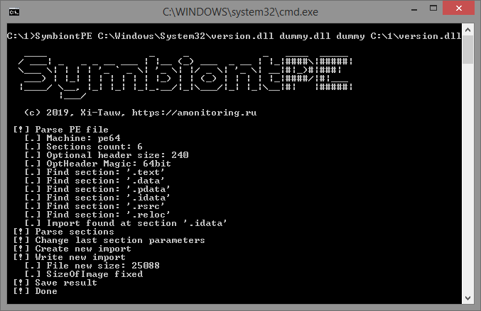

# SymbiontPE

## Description

Simple tool that allows add custom function (with custom dll) to PE-file import section. After that the dll will be force to loaded by executed app. This allows to easily write proxy dll for the app.

For examle some app has version.dll in import (this is almost every app). We want to hijack version.dll through placing custom version.dll with payload near app. One solution is write code of payload dll. For correct loading, payload dll must be same bitness and has same import as original version.dll. If we want app to contine workin after dll hijack, than we need add correct code for all functions in our payload dll (e.g. redirect calls to original library). There are some ways of writing those code (link_github).

But there is another way - we could copy version.dll and add custom function from custom dll. When app started, it loads modified version.dll and OS force app to load custom dll. So, with this approach dll still needed, but this payload dll coulde easily coded, since it has inly two simple requirements - corresponded bittness and export only one function with any prototype (void dummy() {}, will work).

## Sreenshot

## Using

SymbiontPE PathToDll ImportDllName ImportFunctionName OutputPath

* PathToDll - path to original dll

* ImportDllName - dll name to be added to import section

* ImportFunctionName - function name to be added to import section

* OutputPath - output path for saveing result

Example of using:

SymbiontPE C:\Windows\version.dll dummy.dll dummy C:\1\version.dll
